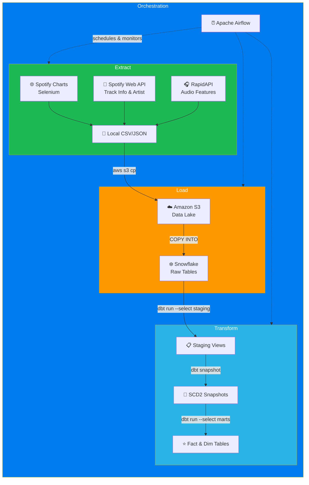
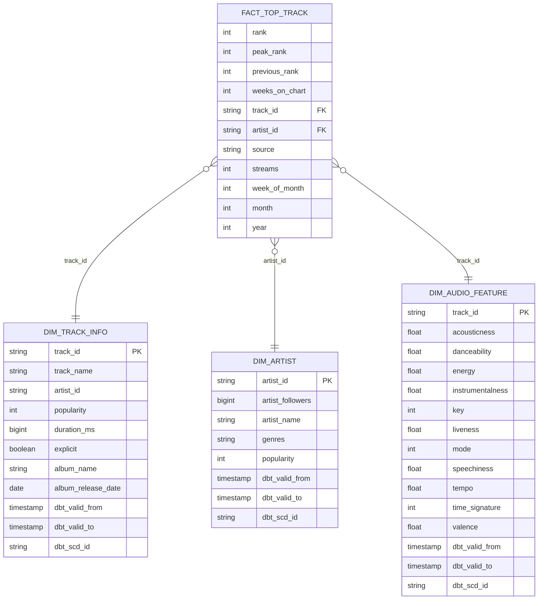

# 🎵 Spotify Hit Predictor & Trend Analyzer Pipeline

An end-to-end **ELT data pipeline** that automatically collects, stores, and transforms Spotify chart data (Regional Vietnam Weekly) for music trend analysis and hit prediction. Orchestrated with **Apache Airflow**, transformed with **dbt**, and warehoused in **Snowflake**.

---

## 🛠️ Tech Stack

| Layer | Technology |
|-------|-----------|
| **Orchestration** |  |
| **Extract** |   |
| **Data Lake** |  |
| **Data Warehouse** |  |
| **Transform** |  |
| **Containerization** |  |
| **API** |   |

---

## 🏗️ Architecture



---

## 📊 Data Model

The warehouse follows a **Star Schema** design with **SCD Type 2** (Slowly Changing Dimensions) for tracking historical changes in artist popularity, audio features, and track metadata.



---

## 🔄 dbt Lineage

The dbt project transforms raw data through 3 layers:

```
Raw Tables (Snowflake)
  └── Sources (sources.yml)
        ├── stg_top_track        ─────────────────────────────────► fact_top_track
        ├── stg_artist           ── dim_artist_snapshot (SCD2) ──► dim_artist
        ├── stg_audio_feature    ── dim_audio_feature_snapshot ──► dim_audio_feature
        └── stg_track_info       ── dim_track_info_snapshot ────► dim_track_info
```

| Layer | Path | Materialization | Description |
|-------|------|----------------|-------------|
| **Sources** | `models/sources/` | — | Defines raw tables in Snowflake as dbt sources |
| **Staging** | `models/staging/` | `view` | Cleans, casts, and renames raw columns |
| **Snapshots** | `snapshots/` | `snapshot` (SCD2) | Tracks historical changes using `check` strategy |
| **Marts** | `models/marts/` | `table` | Business-ready Fact & Dimension tables |

---

## 📁 Project Structure

```text
├── dags/
│   ├── DAG/
│   │   └── script_dags.py          # Airflow DAG definition
│   └── scripts/
│       ├── extract/
│       │   ├── crawl_top_track.py   # Selenium: scrape Spotify Charts (VN Weekly)
│       │   ├── crawl_track_spotify.py  # API: fetch track info (name, album, artists)
│       │   ├── crawl_audio_feature.py  # RapidAPI: fetch audio features
│       │   └── crawl_artist.py      # API: fetch artist details (followers, genres)
│       └── load/
│           ├── load_all_data_to_s3.sh      # Upload local files to S3
│           └── load_all_data_s3_to_snow.py # COPY INTO from S3 to Snowflake
├── dbt/
│   ├── models/
│   │   ├── sources/                 # Source definitions (sources.yml)
│   │   ├── staging/                 # Staging views (stg_*.sql)
│   │   └── marts/                   # Fact & Dim tables
│   ├── snapshots/                   # SCD2 snapshot models
│   ├── macros/                      # Reusable SQL macros (e.g., flatten_array)
│   ├── dbt_project.yml              # dbt project configuration
│   ├── profiles.yml                 # Snowflake connection profile
│   └── packages.yml                 # dbt package dependencies
├── data/                            # Temporary local data storage (gitignored)
├── config/                          # Airflow configuration files
├── plugins/                         # Custom Airflow plugins
├── logs/                            # Airflow logs (gitignored)
├── chrome_profile/                  # Chrome session for Selenium login
├── Dockerfile                       # Custom Airflow image with dependencies
├── docker-compose.yaml              # Full Airflow infrastructure
├── pyproject.toml                   # Python dependencies
├── .env.example                     # Environment variable template
└── README.md
```

---

## 📋 Prerequisites

- [Docker Desktop](https://docs.docker.com/get-docker/) (enable WSL 2 integration on Windows)
- Python 3.12+ (with `uv` or `pip`)
- A [Spotify account](https://www.spotify.com/) (for Charts login)
- A [Spotify Developer App](https://developer.spotify.com/dashboard) (Client ID & Secret)
- [RapidAPI](https://rapidapi.com/) subscription for Spotify Extended Audio Features API
- An [AWS account](https://aws.amazon.com/) with an S3 bucket
- A [Snowflake account](https://signup.snowflake.com/) (free trial works)
- Google Chrome (for local Selenium debugging)

---

## 🚀 Getting Started

### 1. Clone the Repository

```bash
git clone https://github.com/ItsLewis-DE/Spotify-Hit-Predictor-Trend-Analyzer-Pipeline.git
cd Spotify-Hit-Predictor-Trend-Analyzer-Pipeline
```

### 2. Configure Environment Variables

```bash
cp .env.example .env
```

Edit `.env` and fill in **all** required values:

| Variable | Description |
|----------|-------------|
| `SPOTIFY_CLIENT_ID` / `SPOTIFY_CLIENT_SECRET` | From Spotify Developer Dashboard |
| `AWS_ACCESS_KEY_ID` / `AWS_SECRET_ACCESS_KEY` | From AWS IAM Console |
| `SNOWFLAKE_ACCOUNT` / `SNOWFLAKE_USER` / `SNOWFLAKE_PASSWORD` | Your Snowflake credentials |
| `X-RapidAPI-Key-1` to `X-RapidAPI-Key-4` | RapidAPI keys for rate-limit rotation |
| `AIRFLOW_FERNET_KEY` | Generate: `python -c "from cryptography.fernet import Fernet; print(Fernet.generate_key().decode())"` |
| `AIRFLOW_WEBSERVER_SECRET_KEY` | Generate: `python -c "import secrets; print(secrets.token_hex(32))"` |

### 3. Spotify Charts Login (First Time Only)

The crawler needs an authenticated session to download Spotify Charts data. Run this once manually (with a visible browser) to save cookies:

```bash
python -m venv .venv
source .venv/bin/activate  # Windows: .venv\Scripts\activate
pip install -r pyproject.toml

# Opens Chrome — log in manually. Cookies will be saved to spotify_cookies.json
python dags/scripts/extract/crawl_top_track.py --login
```

### 4. Start the Airflow Stack

```bash
# Initialize database & create admin user (FIRST TIME ONLY)
docker compose up airflow-init

# Start all services in detached mode
docker compose up -d
```

### 5. Access the Airflow UI

Open your browser at **http://localhost:8080**

| Field | Default Value |
|-------|--------------|
| Username | `airflow` |
| Password | Value of `_AIRFLOW_WWW_USER_PASSWORD` in `.env` |

Unpause the `spotify_pipeline` DAG to start the automated pipeline.

---

## ⚙️ Pipeline DAG

The DAG `spotify_pipeline` runs on a **weekly schedule** (every Saturday at midnight) and executes the following task chain:

```
extract_top_track → [extract_audio_feature, extract_track_spotify] → extract_artist
    → load_all_data_to_s3 → load_all_data_s3_to_snow → dbt_run
```

The `dbt_run` task internally executes:
1. `dbt deps` — Install packages (only if `dbt_packages/` doesn't exist)
2. `dbt run --select staging` — Create/refresh staging views
3. `dbt snapshot` — Capture SCD2 changes
4. `dbt run --select marts` — Build Fact & Dimension tables

---

## 🔧 Useful Docker Commands

```bash
# Stop and remove all containers
docker compose down

# View scheduler logs (for debugging DAG failures)
docker compose logs -f airflow-scheduler

# Open a bash shell inside the Airflow container
docker compose run --rm airflow-cli bash

# Rebuild the image after changing Dockerfile or dependencies
docker compose build --no-cache
```
