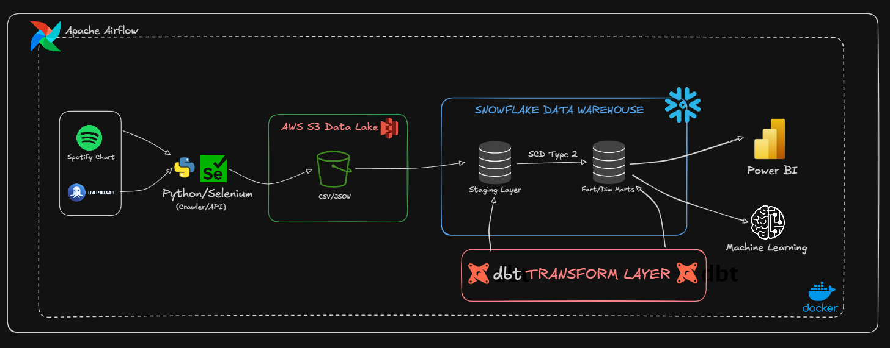
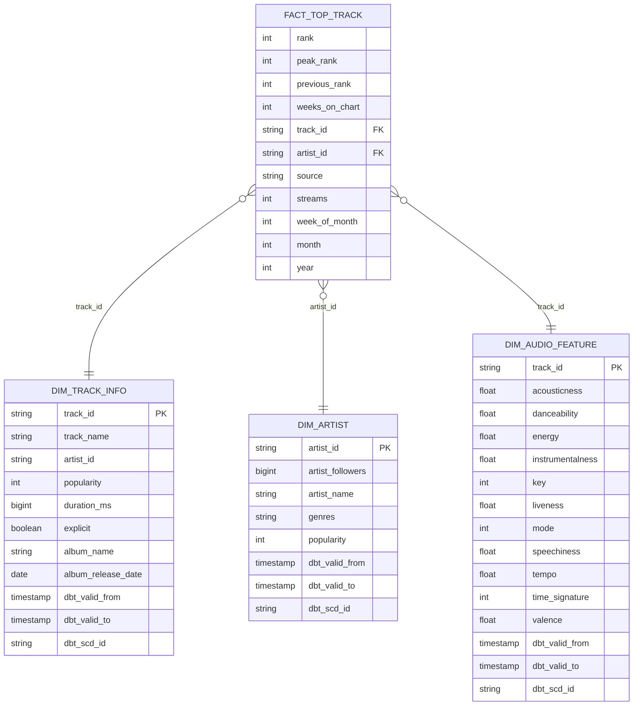
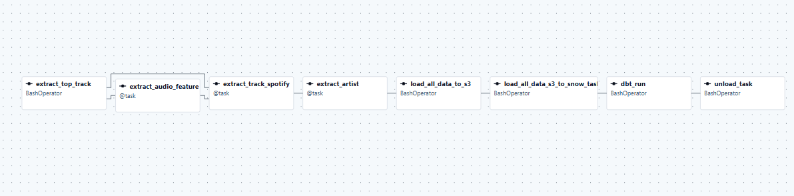

# 🎵 Spotify Hit Predictor & Trend Analyzer Pipeline

An end-to-end **ELT data pipeline** combined with **Machine Learning** that automatically collects, stores, transforms Spotify chart data (Regional Vietnam Weekly), and predicts whether a song will become a Top 10 hit. Orchestrated with **Apache Airflow**, transformed with **dbt**, warehoused in **Snowflake**, and analyzed using **Python (XGBoost/LightGBM)**.

---

## 🛠️ Tech Stack

| Layer | Technology |
|-------|-----------|
| **Orchestration** |  |
| **Extract** |   |
| **Data Lake** |  |
| **Data Warehouse** |  |
| **Transform** |  |
| **Machine Learning** |   |
| **Containerization** |  |
| **API** |   |

---

## 🏗️ Architecture


---

## 🧠 Machine Learning: Hit Predictor

Besides the robust data pipeline, this project includes a Machine Learning component (`dags/scripts/ml/ML.ipynb`) aimed at **Early Trajectory Prediction**.

### Bài toán dự đoán (The Problem)
**Câu hỏi:** Sau khi bài hát lọt chart trong tuần đầu tiên, liệu bài hát có đạt được **Top 10** vào những tuần kế tiếp hay không?

### Phương pháp tiếp cận (Approach)
1. **Dữ liệu huấn luyện:** Lấy từ các bảng Fact và Dimension trong Data Warehouse (Snowflake) sau khi dbt đã transform. Dữ liệu sạch, được join hoàn chỉnh giữa thông tin track, audio features và artist popularity.
2. **Feature Engineering:**
   - **Audio Features:** Danceability, energy, valence, acousticness, v.v.
   - **Artist Metrics:** Số lượng followers, popularity trung bình/tối đa của nghệ sĩ (hỗ trợ tốt cho collab tracks).
   - **Interaction Features:** Tính toán tỷ lệ `momentum_ratio`, `stream_efficiency`, `followers_per_rank` để đánh giá tiềm năng bứt phá của bài hát.
3. **Mô hình hóa (Modeling):**
   - Xử lý mất cân bằng dữ liệu (Imbalanced data) bằng **SMOTE**.
   - Đánh giá bằng **Stratified 5-Fold Cross-Validation**.
   - So sánh 3 mô hình Gradient Boosting và Ensemble hàng đầu: **RandomForest**, **XGBoost**, và **LightGBM**.
   - Hyperparameter Tuning với **GridSearchCV**.

### Kết luận & Insights
- Các mô hình (đặc biệt là XGBoost) mang lại kết quả F1 Score ổn định.
- **Top Predictors:** Vị trí debut (`debut_rank`), số lượt stream tuần đầu (`debut_streams`), và sức ảnh hưởng của nghệ sĩ (`artist_popularity`) là những tín hiệu mạnh nhất dự đoán việc lọt Top 10. Các đặc trưng âm thanh (Audio Features) đóng vai trò bổ sung nhưng không quyết định xu hướng viral bằng độ nổi tiếng sẵn có của ca sĩ.

---

## 📊 Data Model

The warehouse follows a **Star Schema** design with **SCD Type 2** (Slowly Changing Dimensions) for tracking historical changes in artist popularity, audio features, and track metadata.



---

## 🔄 dbt Lineage

The dbt project transforms raw data through 3 layers:

```text
Raw Tables (Snowflake)
  └── Sources (sources.yml)
        ├── stg_top_track        ─────────────────────────────────► fact_top_track
        ├── stg_artist           ── dim_artist_snapshot (SCD2) ──► dim_artist
        ├── stg_audio_feature    ── dim_audio_feature_snapshot ──► dim_audio_feature
        └── stg_track_info       ── dim_track_info_snapshot ────► dim_track_info
```

| Layer | Path | Materialization | Description |
|-------|------|----------------|-------------|
| **Sources** | `models/sources/` | — | Defines raw tables in Snowflake as dbt sources |
| **Staging** | `models/staging/` | `view` | Cleans, casts, and renames raw columns |
| **Snapshots** | `snapshots/` | `snapshot` (SCD2) | Tracks historical changes using `check` strategy |
| **Marts** | `models/marts/` | `table` | Business-ready Fact & Dimension tables |

---

## 📁 Project Structure

```text
├── dags/
│   ├── DAG/
│   │   └── script_dags.py          # Airflow DAG definition
│   └── scripts/
│       ├── extract/                # Selenium & API Crawlers
│       ├── load/                   # S3 & Snowflake Loading Scripts
│       └── ml/
│           └── ML.ipynb            # Machine Learning Predictive Model
├── dbt/                            # dbt transformation models
├── image/                          # Architecture & DAG diagrams
├── chrome_profile/                 # Chrome session for Selenium login
├── Dockerfile                      # Custom Airflow image with dependencies
├── docker-compose.yaml             # Full Airflow infrastructure
├── pyproject.toml                  # Python dependencies
├── .env.example                    # Environment variable template
└── README.md
```

---

## 📋 Prerequisites

- [Docker Desktop](https://docs.docker.com/get-docker/) (enable WSL 2 integration on Windows)
- Python 3.12+ (with `uv` or `pip`)
- A [Spotify account](https://www.spotify.com/) (for Charts login)
- A [Spotify Developer App](https://developer.spotify.com/dashboard) (Client ID & Secret)
- [RapidAPI](https://rapidapi.com/) subscription for Spotify Extended Audio Features API
- An [AWS account](https://aws.amazon.com/) with an S3 bucket
- A [Snowflake account](https://signup.snowflake.com/) (free trial works)
- Google Chrome (for local Selenium debugging)

---

## 🚀 Hướng Dẫn Khởi Chạy (Getting Started)

Vui lòng làm theo các bước dưới đây theo thứ tự để thiết lập và chạy toàn bộ dự án.

### 1. Clone the Repository

```bash
git clone https://github.com/ItsLewis-DE/Spotify-Hit-Predictor-Trend-Analyzer-Pipeline.git
cd Spotify-Hit-Predictor-Trend-Analyzer-Pipeline
```

### 2. Thiết lập Environment Variables (.env)

Bạn cần tạo file `.env` từ file mẫu và điền đầy đủ các thông tin xác thực.

```bash
cp .env.example .env
```

Mở file `.env` và điền **tất cả** các giá trị cần thiết:
- `SPOTIFY_CLIENT_ID` / `SPOTIFY_CLIENT_SECRET` (Từ Spotify Developer Dashboard)
- `AWS_ACCESS_KEY_ID` / `AWS_SECRET_ACCESS_KEY` (Từ AWS IAM)
- `SNOWFLAKE_ACCOUNT` / `SNOWFLAKE_USER` / `SNOWFLAKE_PASSWORD`
- Các key của `RapidAPI`
- Tạo `AIRFLOW_FERNET_KEY` và `AIRFLOW_WEBSERVER_SECRET_KEY` bằng lệnh Python được gợi ý ngay trong file `.env`.

### 3. Đăng nhập Spotify Charts (Chỉ chạy LẦN ĐẦU)

Crawler cần một session đã đăng nhập để tải dữ liệu Spotify Charts (bằng Selenium). Bạn cần chạy thủ công đoạn script sau để hiện trình duyệt Chrome, sau đó đăng nhập bằng tay. Cookie sẽ được lưu lại cho Airflow sử dụng sau này.

```bash
# Tạo môi trường ảo và cài đặt thư viện
python -m venv .venv
source .venv/bin/activate  # Trên Windows: .venv\Scripts\activate
pip install -r pyproject.toml

# Chạy lệnh đăng nhập. Trình duyệt Chrome sẽ mở ra, hãy tự đăng nhập Spotify.
# Sau khi đăng nhập thành công, Cookie sẽ tự động được lưu.
python dags/scripts/extract/crawl_top_track.py --login
```

### 4. Khởi động hệ thống Airflow (Docker Compose)

> **Lưu ý quan trọng:** Nếu bạn gặp lỗi `pull access denied for spotify-airflow...` thì là do image chưa được build. Quá trình build có chứa lệnh `pip install` nên sẽ mất vài phút. **Hãy kiên nhẫn đợi lệnh chạy xong, đừng nhấn `Ctrl+C`.**

```bash
# BƯỚC 4.1: Build custom Airflow image (cài đặt Selenium, dbt, Snowflake connector...)
docker compose build

# BƯỚC 4.2: Khởi tạo database & tạo tài khoản admin cho Airflow (CHỈ CHẠY LẦN ĐẦU TIÊN)
docker compose up airflow-init

# BƯỚC 4.3: Chạy tất cả các dịch vụ (Webserver, Scheduler, Postgres, Selenium...) ở chế độ background
docker compose up -d
```

### 5. Truy cập Airflow UI

Mở trình duyệt và truy cập: **http://localhost:8080**

| Field | Default Value |
|-------|--------------|
| Username | `airflow` |
| Password | Giá trị của biến `_AIRFLOW_WWW_USER_PASSWORD` trong file `.env` (mặc định là `airflow`) |

Vào giao diện, bật (unpause) DAG `spotify_pipeline` để kích hoạt quá trình tự động hóa.

---

## ⚙️ Pipeline DAG

Dưới đây là luồng thực thi (Task Flow) của Airflow DAG. DAG được đặt lịch chạy **hàng tuần** (Vào nửa đêm Thứ Bảy).



Trình tự thực thi:
1. `extract_top_track` (Selenium scrape chart)
2. Song song: `extract_audio_feature` & `extract_track_spotify`
3. `extract_artist`
4. `load_all_data_to_s3`
5. `load_all_data_s3_to_snow`
6. `dbt_run` (Bao gồm Staging -> Snapshot SCD2 -> Marts)
7. `unload_task`

---

## 🔧 Useful Docker Commands

```bash
# Dừng và xóa tất cả containers
docker compose down

# Xem log của Scheduler (Rất hữu ích khi cần debug lỗi DAG)
docker compose logs -f airflow-scheduler

# Mở bash terminal vào bên trong Airflow container
docker compose run --rm airflow-cli bash

# Build lại image nếu bạn thay đổi file Dockerfile hoặc thêm package vào pyproject.toml
docker compose build --no-cache
```
