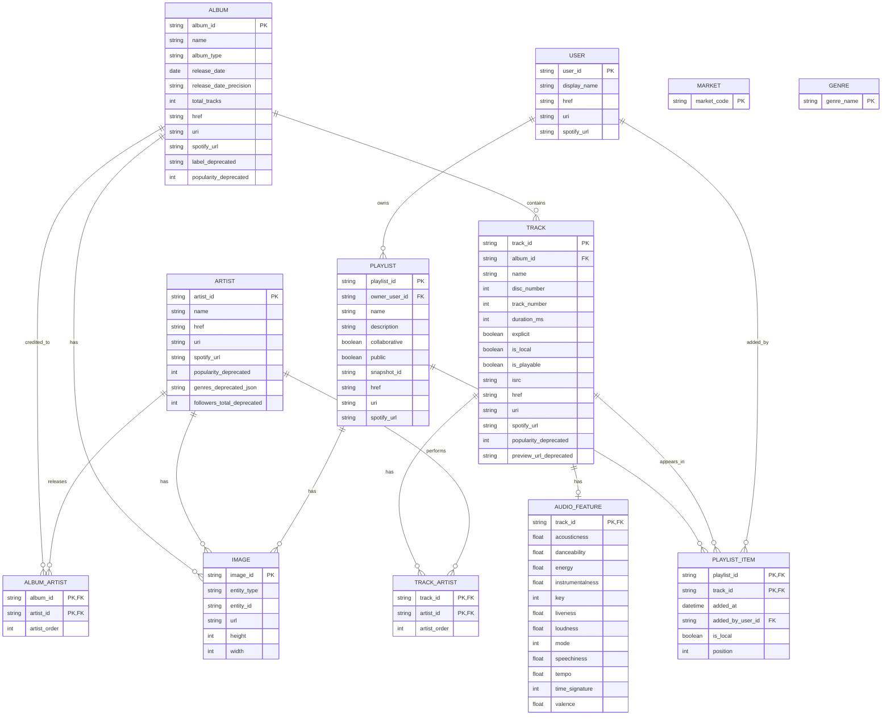

# Spotify Web API Analysis

Tai lieu nay tham khao cach trinh bay cua `Project Stock.pdf`: neu nguon du lieu, liet ke bien API tra ve theo tung muc, neu quan he du lieu va ve ERD phu hop voi pipeline phan tich xu huong am nhac.

## 1. Data source

- Spotify Web API: https://developer.spotify.com/documentation/web-api
- Base URL: `https://api.spotify.com/v1`
- Auth endpoint: `https://accounts.spotify.com/api/token`
- Auth flow phu hop cho du lieu cong khai: Client Credentials Flow.
- Access token duoc gui trong header: `Authorization: Bearer <access_token>`.

Luu y ve chinh sach: cac trang reference cua Spotify hien co policy note rang Spotify content khong duoc dung de train machine learning hoac AI model. Neu project van lam "hit prediction", can can than phan biet giua bai tap hoc tap noi bo va viec build san pham/training model dua tren Spotify content.

## 2. Cac API chinh nen dung

| Muc | Endpoint | Muc dich | Tan suat goi goi y |
| --- | --- | --- | --- |
| Authentication | `POST /api/token` | Lay `access_token` de goi Web API | Moi khi token het han |
| Search | `GET /search` | Tim track, artist, album, playlist theo keyword | Theo batch crawl |
| Tracks | `GET /tracks/{id}` | Lay metadata chi tiet cua 1 track | Hang ngay/theo batch |
| Audio Features | `GET /audio-features/{id}` | Lay dac trung am thanh cua track | Theo track moi |
| Artists | `GET /artists/{id}` | Lay metadata artist | Hang tuan/thang |
| Artist Albums | `GET /artists/{id}/albums` | Lay album cua artist | Hang tuan/thang |
| Artist Top Tracks | `GET /artists/{id}/top-tracks` | Lay top tracks cua artist | Hang ngay/tuan |
| Albums | `GET /albums/{id}` | Lay metadata album va danh sach track trong album | Theo album moi |
| Album Tracks | `GET /albums/{id}/tracks` | Lay track trong album dang paging | Theo album moi |
| Playlists | `GET /playlists/{playlist_id}` | Lay metadata playlist va paging items | Hang ngay/tuan |
| Playlist Items | `GET /playlists/{playlist_id}/items` | Lay cac item/track trong playlist | Hang ngay |
| Markets | `GET /markets` | Lay danh sach country/market code kha dung | Thang/quy |
| Genre Seeds | `GET /recommendations/available-genre-seeds` | Lay danh sach genre seed | Thang/quy |
| User Profile | `GET /me` | Lay thong tin user hien tai, can Authorization Code/PKCE | Khi can du lieu user |

## 3. Params bat buoc/tuy chon khi goi API

Tat ca endpoint Web API duoi domain `https://api.spotify.com/v1` can header:

| Header | Bat buoc | Gia tri | Ghi chu |
| --- | --- | --- | --- |
| `Authorization` | Co | `Bearer <access_token>` | Token lay tu OAuth. |

### 3.1 `POST https://accounts.spotify.com/api/token`

| Vi tri | Param/Header | Kieu | Bat buoc | Gia tri/vi du | Mo ta |
| --- | --- | --- | --- | --- | --- |
| Header | `Authorization` | string | Co | `Basic base64(client_id:client_secret)` | Dung Client ID va Client Secret da encode Base64. |
| Header | `Content-Type` | string | Co | `application/x-www-form-urlencoded` | Dinh dang body. |
| Body | `grant_type` | string | Co | `client_credentials` | Xac dinh flow lay token server-to-server. |

### 3.2 `GET /search`

| Vi tri | Param | Kieu | Bat buoc | Default/vi du | Mo ta |
| --- | --- | --- | --- | --- | --- |
| Query | `q` | string | Co | `remaster track:Doxy artist:Miles Davis` | Cau truy van tim kiem. Co the dung filter `album`, `artist`, `track`, `year`, `upc`, `isrc`, `genre`, `tag:new`, `tag:hipster`. |
| Query | `type` | array/string CSV | Co | `track`, `album,track` | Loai item can search. Gia tri: `album`, `artist`, `playlist`, `track`, `show`, `episode`, `audiobook`. |
| Query | `market` | string | Khong | `ES` | Ma quoc gia ISO 3166-1 alpha-2; loc content kha dung theo market. |
| Query | `limit` | integer | Khong | Default `5`, vi du `10` | So ket qua moi page. |
| Query | `offset` | integer | Khong | Default `0`, vi du `5` | Vi tri bat dau cua page. |
| Query | `include_external` | string | Khong | `audio` | Bao gom audio content ben ngoai neu co. |

### 3.3 `GET /tracks/{id}`

| Vi tri | Param | Kieu | Bat buoc | Vi du | Mo ta |
| --- | --- | --- | --- | --- | --- |
| Path | `id` | string | Co | `11dFghVXANMlKmJXsNCbNl` | Spotify Track ID. |
| Query | `market` | string | Khong | `ES` | Ma country de loc availability/playability. |

### 3.4 `GET /audio-features/{id}`

| Vi tri | Param | Kieu | Bat buoc | Vi du | Mo ta |
| --- | --- | --- | --- | --- | --- |
| Path | `id` | string | Co | `11dFghVXANMlKmJXsNCbNl` | Spotify Track ID. |

### 3.5 `GET /artists/{id}`

| Vi tri | Param | Kieu | Bat buoc | Vi du | Mo ta |
| --- | --- | --- | --- | --- | --- |
| Path | `id` | string | Co | `0TnOYISbd1XYRBk9myaseg` | Spotify Artist ID. |

### 3.6 `GET /artists/{id}/albums`

| Vi tri | Param | Kieu | Bat buoc | Default/vi du | Mo ta |
| --- | --- | --- | --- | --- | --- |
| Path | `id` | string | Co | `0TnOYISbd1XYRBk9myaseg` | Spotify Artist ID. |
| Query | `include_groups` | string CSV | Khong | `single,appears_on` | Nhom album can lay: `album`, `single`, `appears_on`, `compilation`. |
| Query | `market` | string | Khong | `ES` | Ma country de loc album kha dung. |
| Query | `limit` | integer | Khong | Default `5` | So album moi page. |
| Query | `offset` | integer | Khong | Default `0` | Vi tri bat dau cua page. |

### 3.7 `GET /artists/{id}/top-tracks`

| Vi tri | Param | Kieu | Bat buoc | Vi du | Mo ta |
| --- | --- | --- | --- | --- | --- |
| Path | `id` | string | Co | `0TnOYISbd1XYRBk9myaseg` | Spotify Artist ID. |
| Query | `market` | string | Khong | `ES` | Ma country de loc top tracks. |

### 3.8 `GET /albums/{id}`

| Vi tri | Param | Kieu | Bat buoc | Vi du | Mo ta |
| --- | --- | --- | --- | --- | --- |
| Path | `id` | string | Co | `4aawyAB9vmqN3uQ7FjRGTy` | Spotify Album ID. |
| Query | `market` | string | Khong | `ES` | Ma country de loc album/track availability. |

### 3.9 `GET /albums/{id}/tracks`

| Vi tri | Param | Kieu | Bat buoc | Default/vi du | Mo ta |
| --- | --- | --- | --- | --- | --- |
| Path | `id` | string | Co | `4aawyAB9vmqN3uQ7FjRGTy` | Spotify Album ID. |
| Query | `market` | string | Khong | `ES` | Ma country de loc tracks. |
| Query | `limit` | integer | Khong | Default `20`, vi du `10` | So track moi page. |
| Query | `offset` | integer | Khong | Default `0`, vi du `5` | Vi tri bat dau cua page. |

### 3.10 `GET /playlists/{playlist_id}`

| Vi tri | Param | Kieu | Bat buoc | Vi du | Mo ta |
| --- | --- | --- | --- | --- | --- |
| Path | `playlist_id` | string | Co | `3cEYpjA9oz9GiPac4AsH4n` | Spotify Playlist ID. |
| Query | `market` | string | Khong | `ES` | Ma country de loc item availability. |
| Query | `fields` | string | Khong | `items(added_by.id,track(name,href,album(name,href)))` | Loc field can tra ve de giam payload. |
| Query | `additional_types` | string | Khong | `track,episode` | Loai item bo sung; voi project nhac nen uu tien `track`. |

### 3.11 `GET /playlists/{playlist_id}/items`

| Vi tri | Param | Kieu | Bat buoc | Default/vi du | Mo ta |
| --- | --- | --- | --- | --- | --- |
| Path | `playlist_id` | string | Co | `3cEYpjA9oz9GiPac4AsH4n` | Spotify Playlist ID. |
| Query | `market` | string | Khong | `ES` | Ma country de loc track availability. |
| Query | `fields` | string | Khong | `items(added_by.id,track(name,href,album(name,href)))` | Loc field can tra ve. |
| Query | `limit` | integer | Khong | Default `20`, vi du `10` | So playlist items moi page. |
| Query | `offset` | integer | Khong | Default `0`, vi du `5` | Vi tri bat dau cua page. |
| Query | `additional_types` | string | Khong | `track,episode` | Loai item bo sung; voi pipeline am nhac nen filter `track`. |

### 3.12 `GET /markets`

| Vi tri | Param | Kieu | Bat buoc | Mo ta |
| --- | --- | --- | --- | --- |
| None | None | None | Khong | Endpoint nay khong co path/query params, chi can `Authorization: Bearer <access_token>`. |

### 3.13 `GET /recommendations/available-genre-seeds`

| Vi tri | Param | Kieu | Bat buoc | Mo ta |
| --- | --- | --- | --- | --- |
| None | None | None | Khong | Endpoint nay khong co path/query params, chi can `Authorization: Bearer <access_token>`. |

### 3.14 `GET /me`

| Vi tri | Param | Kieu | Bat buoc | Mo ta |
| --- | --- | --- | --- | --- |
| None | None | None | Khong | Khong co path/query params, nhung can user access token tu Authorization Code/PKCE va scope phu hop neu lay email/private fields. |

## 4. Bien API tra ve theo muc

### 4.1 Authentication token response

| Bien | Kieu | Bat buoc | Mo ta |
| --- | --- | --- | --- |
| `access_token` | string | Co | Token dung de goi Spotify Web API. |
| `token_type` | string | Co | Thuong la `Bearer`. |
| `expires_in` | integer | Co | So giay token con hieu luc, thuong la `3600`. |

### 4.2 Common objects

| Object | Bien | Kieu | Mo ta |
| --- | --- | --- | --- |
| `ExternalUrlObject` | `spotify` | string | URL mo object tren Spotify. |
| `ExternalIdObject` | `isrc` | string | Ma ISRC cua track. |
| `ExternalIdObject` | `ean` | string | Ma EAN cua album/recording. |
| `ExternalIdObject` | `upc` | string | Ma UPC cua album/recording. |
| `ImageObject` | `url` | string | URL anh. |
| `ImageObject` | `height` | integer/null | Chieu cao anh, co the null. |
| `ImageObject` | `width` | integer/null | Chieu rong anh, co the null. |
| `FollowersObject` | `href` | string/null | Link API chi tiet followers, thuong null. |
| `FollowersObject` | `total` | integer | Tong so followers. |
| `RestrictionObject` | `reason` | string | Ly do object bi gioi han, vi du market/product/explicit. |
| `PagingObject` | `href` | string | URL cua request paging hien tai. |
| `PagingObject` | `items` | array | Danh sach object trong page. |
| `PagingObject` | `limit` | integer | So item toi da moi page. |
| `PagingObject` | `next` | string/null | URL page tiep theo. |
| `PagingObject` | `offset` | integer | Vi tri bat dau page. |
| `PagingObject` | `previous` | string/null | URL page truoc. |
| `PagingObject` | `total` | integer | Tong so item. |

### 4.3 TrackObject - `GET /tracks/{id}`

| Bien | Kieu | Deprecated | Mo ta |
| --- | --- | --- | --- |
| `id` | string | Khong | Spotify ID cua track, khoa chinh nen dung trong database. |
| `name` | string | Khong | Ten track. |
| `album` | object `SimplifiedAlbumObject` | Khong | Album chua track. |
| `artists` | array `SimplifiedArtistObject` | Khong | Cac artist cua track. Tao bang bridge `track_artist`. |
| `available_markets` | array string | Co | Cac market ISO 3166-1 alpha-2 ma track kha dung. |
| `disc_number` | integer | Khong | So dia trong album. |
| `duration_ms` | integer | Khong | Do dai track tinh bang milliseconds. |
| `explicit` | boolean | Khong | Track co noi dung explicit hay khong. |
| `external_ids` | object `ExternalIdObject` | Khong | Ma ngoai nhu `isrc`, `ean`, `upc`. |
| `external_urls` | object `ExternalUrlObject` | Khong | URL tren Spotify. |
| `href` | string | Khong | URL Web API cho track. |
| `is_local` | boolean | Khong | Track co phai file local cua user hay khong. |
| `is_playable` | boolean | Khong | Track co play duoc trong market/context hay khong. |
| `linked_from` | object | Co | Thong tin track goc khi relinking. |
| `popularity` | integer | Co | Do pho bien 0-100 theo Spotify, deprecated trong docs hien tai. |
| `preview_url` | string/null | Co | URL audio preview, deprecated/null trong docs hien tai. |
| `restrictions` | object `TrackRestrictionObject` | Khong | Gioi han phat track. |
| `track_number` | integer | Khong | Thu tu track trong album. |
| `type` | string enum `track` | Khong | Loai object. |
| `uri` | string | Khong | Spotify URI, vi du `spotify:track:<id>`. |

### 4.4 AudioFeaturesObject - `GET /audio-features/{id}`

| Bien | Kieu | Mo ta |
| --- | --- | --- |
| `id` | string | Spotify track ID; quan he 1-1 voi `TrackObject.id`. |
| `acousticness` | number | Do uoc luong acoustic, 0.0-1.0. |
| `danceability` | number | Muc do phu hop de nhay, 0.0-1.0. |
| `energy` | number | Muc nang luong, 0.0-1.0. |
| `instrumentalness` | number | Xac suat track khong co vocal, 0.0-1.0. |
| `key` | integer | Key am nhac theo pitch class, -1 neu khong xac dinh. |
| `liveness` | number | Xac suat track la live performance, 0.0-1.0. |
| `loudness` | number | Do lon trung binh tinh bang dB. |
| `mode` | integer | 1 la major, 0 la minor. |
| `speechiness` | number | Muc do spoken-word, 0.0-1.0. |
| `tempo` | number | BPM uoc luong. |
| `time_signature` | integer | Nhip uoc luong, thuong 3-7. |
| `valence` | number | Muc do tich cuc/am sang cua track, 0.0-1.0. |
| `duration_ms` | integer | Do dai track theo milliseconds. |
| `analysis_url` | string | URL audio analysis chi tiet. |
| `track_href` | string | URL Web API cua track. |
| `type` | string enum `audio_features` | Loai object. |
| `uri` | string | Spotify URI cua track. |

### 4.5 AlbumObject - `GET /albums/{id}`

| Bien | Kieu | Deprecated | Mo ta |
| --- | --- | --- | --- |
| `id` | string | Khong | Spotify ID cua album, khoa chinh. |
| `name` | string | Khong | Ten album. |
| `album_type` | string enum `album/single/compilation` | Khong | Loai album. |
| `artists` | array `SimplifiedArtistObject` | Khong | Artist cua album. Tao bang bridge `album_artist`. |
| `available_markets` | array string | Co | Market album kha dung. |
| `copyrights` | array `CopyrightObject` | Khong | Thong tin copyright, gom `text`, `type`. |
| `external_ids` | object `ExternalIdObject` | Khong | ID ngoai nhu UPC/EAN. |
| `external_urls` | object `ExternalUrlObject` | Khong | URL Spotify. |
| `genres` | array string | Co | Genre cua album, deprecated trong docs hien tai. |
| `href` | string | Khong | URL Web API cua album. |
| `images` | array `ImageObject` | Khong | Cover art theo nhieu kich thuoc. |
| `label` | string | Co | Record label, deprecated trong docs hien tai. |
| `popularity` | integer | Co | Popularity 0-100, deprecated trong docs hien tai. |
| `release_date` | string | Khong | Ngay phat hanh, do chinh xac phu thuoc `release_date_precision`. |
| `release_date_precision` | string enum `year/month/day` | Khong | Do chinh xac cua release date. |
| `restrictions` | object `AlbumRestrictionObject` | Khong | Gioi han album. |
| `total_tracks` | integer | Khong | Tong so track trong album. |
| `tracks` | object `PagingObject` | Khong | Danh sach simplified tracks cua album. |
| `type` | string enum `album` | Khong | Loai object. |
| `uri` | string | Khong | Spotify URI cua album. |

### 4.6 ArtistObject - `GET /artists/{id}`

| Bien | Kieu | Deprecated | Mo ta |
| --- | --- | --- | --- |
| `id` | string | Khong | Spotify ID cua artist, khoa chinh. |
| `name` | string | Khong | Ten artist. |
| `external_urls` | object `ExternalUrlObject` | Khong | URL Spotify. |
| `followers` | object `FollowersObject` | Co | Tong follower, deprecated trong docs hien tai. |
| `genres` | array string | Co | Genre cua artist, deprecated trong docs hien tai. |
| `href` | string | Khong | URL Web API cua artist. |
| `images` | array `ImageObject` | Khong | Anh artist. |
| `popularity` | integer | Co | Popularity 0-100, deprecated trong docs hien tai. |
| `type` | string enum `artist` | Khong | Loai object. |
| `uri` | string | Khong | Spotify URI cua artist. |

### 4.7 PlaylistObject - `GET /playlists/{playlist_id}`

| Bien | Kieu | Deprecated | Mo ta |
| --- | --- | --- | --- |
| `id` | string | Khong | Spotify playlist ID, khoa chinh. |
| `name` | string | Khong | Ten playlist. |
| `description` | string/null | Khong | Mo ta playlist. |
| `collaborative` | boolean | Khong | Playlist co collaborative hay khong. |
| `public` | boolean | Khong | Playlist public hay private. |
| `owner` | object `PlaylistUserObject` | Khong | User so huu playlist, gom `id`, `display_name`, `href`, `uri`, `type`, `external_urls`. |
| `images` | array `ImageObject` | Khong | Anh playlist. |
| `external_urls` | object `ExternalUrlObject` | Khong | URL Spotify. |
| `href` | string | Khong | URL Web API cua playlist. |
| `items` | object `PagingObject` | Khong | Items cua playlist theo paging. |
| `tracks` | object `PagingObject` | Co | Truong cu cho track paging, deprecated trong docs hien tai. |
| `snapshot_id` | string | Khong | Version ID cua playlist, dung de detect thay doi. |
| `type` | string | Khong | Loai object. |
| `uri` | string | Khong | Spotify URI cua playlist. |

### 4.8 Playlist item - `GET /playlists/{playlist_id}/items`

| Bien | Kieu | Mo ta |
| --- | --- | --- |
| `added_at` | string datetime | Thoi diem item duoc them vao playlist. |
| `added_by` | object `PlaylistUserObject` | User them item. |
| `is_local` | boolean | Item co phai local hay khong. |
| `track` | object `TrackObject` hoac `EpisodeObject` | Noi dung trong playlist; voi project am nhac nen filter `track.type = "track"`. |
| `primary_color` | string/null | Mau chinh neu co. |
| `video_thumbnail` | object | Thumbnail video neu co. |

### 4.9 Search response - `GET /search`

| Bien | Kieu | Mo ta |
| --- | --- | --- |
| `tracks` | object `PagingObject` | Ket qua track, item la `TrackObject`. |
| `artists` | object `PagingObject` | Ket qua artist, item la `ArtistObject`. |
| `albums` | object `PagingObject` | Ket qua album, item la `SimplifiedAlbumObject`. |
| `playlists` | object `PagingObject` | Ket qua playlist, item la `SimplifiedPlaylistObject`. |
| `shows` | object `PagingObject` | Ket qua podcast show. Khong dua vao ERD chinh neu project chi phan tich nhac. |
| `episodes` | object `PagingObject` | Ket qua podcast episode. Khong dua vao ERD chinh neu project chi phan tich nhac. |
| `audiobooks` | object `PagingObject` | Ket qua audiobook. Khong dua vao ERD chinh neu project chi phan tich nhac. |

### 4.10 PrivateUserObject - `GET /me`

| Bien | Kieu | Deprecated | Mo ta |
| --- | --- | --- | --- |
| `id` | string | Khong | Spotify user ID. |
| `display_name` | string | Khong | Ten hien thi. |
| `country` | string | Co | Country cua user, deprecated trong docs hien tai. |
| `email` | string | Co | Email user, can scope `user-read-email`, deprecated trong docs hien tai. |
| `explicit_content` | object | Co | Setting explicit content, deprecated trong docs hien tai. |
| `external_urls` | object `ExternalUrlObject` | Khong | URL Spotify. |
| `followers` | object `FollowersObject` | Co | Tong followers, deprecated trong docs hien tai. |
| `href` | string | Khong | URL Web API cua user. |
| `images` | array `ImageObject` | Khong | Anh profile. |
| `product` | string | Co | Loai account, deprecated trong docs hien tai. |
| `type` | string | Khong | Loai object. |
| `uri` | string | Khong | Spotify URI cua user. |

### 4.11 Markets and genres

| Endpoint | Bien | Kieu | Mo ta |
| --- | --- | --- | --- |
| `GET /markets` | `markets` | array string | Danh sach country code ISO 3166-1 alpha-2 kha dung. |
| `GET /recommendations/available-genre-seeds` | `genres` | array string | Danh sach genre seeds kha dung cho recommendation/search pipeline. |

## 5. Quan he du lieu

Co the ve ERD. Cac object Spotify co ID on dinh va co quan he ro rang:

- `Track` thuoc ve 1 `Album`.
- `Track` co nhieu `Artist`, va `Artist` co nhieu `Track` => many-to-many qua `track_artist`.
- `Album` co nhieu `Artist`, va `Artist` co nhieu `Album` => many-to-many qua `album_artist`.
- `Album` co nhieu `Track`.
- `Track` co 0/1 `AudioFeatures`.
- `Playlist` co nhieu `Track`, va `Track` co the nam trong nhieu playlist => many-to-many qua `playlist_item`.
- `Playlist` thuoc 1 `User` owner.
- `Search` la nguon crawl/metadata capture, khong nhat thiet la entity bat buoc trong warehouse. Neu can audit crawl, tao `search_run` va `search_result`.

## 6. ERD de xuat

## 7. Snowflake/data warehouse goi y

Fact table phu hop:

- `fact_playlist_track_daily`: moi dong dai dien cho 1 track x playlist x ngay crawl.
- `fact_track_audio_feature`: moi dong dai dien cho 1 track va dac trung audio tai thoi diem crawl.
- `fact_artist_top_track_daily`: moi dong dai dien cho 1 track nam trong top tracks cua artist tai ngay crawl.

Dimension table phu hop:

- `dim_track`
- `dim_album`
- `dim_artist`
- `dim_playlist`
- `dim_user`
- `dim_market`
- `dim_genre`
- `bridge_track_artist`
- `bridge_album_artist`

## 8. Ghi chu trien khai

- Dung `Client Credentials Flow` cho catalog data cong khai: search, track, artist, album, playlist public, markets, genre seeds.
- Dung `Authorization Code / PKCE` neu can du lieu user/private playlist/current user profile.
- Nen luu raw JSON vao `data/raw/spotify/...` truoc, sau do normalize sang bang warehouse.
- Can luu `crawl_date` hoac `ingested_at` tren cac fact table de phan tich xu huong theo thoi gian.
- Cac field deprecated nen tach cot co hau to `_deprecated` hoac khong dua vao model chinh, vi co the bien mat trong API tuong lai.

## 9. Sources

- Spotify Web API overview: https://developer.spotify.com/documentation/web-api
- Client Credentials Flow: https://developer.spotify.com/documentation/web-api/tutorials/client-credentials-flow
- Get Track: https://developer.spotify.com/documentation/web-api/reference/get-track
- Get Track's Audio Features: https://developer.spotify.com/documentation/web-api/reference/get-audio-features
- Get Album: https://developer.spotify.com/documentation/web-api/reference/get-an-album
- Get Artist: https://developer.spotify.com/documentation/web-api/reference/get-an-artist
- Get Playlist: https://developer.spotify.com/documentation/web-api/reference/get-playlist
- Get Playlist Items: https://developer.spotify.com/documentation/web-api/reference/get-playlists-items
- Search: https://developer.spotify.com/documentation/web-api/reference/search
- Get Current User's Profile: https://developer.spotify.com/documentation/web-api/reference/get-current-users-profile
- Get Available Markets: https://developer.spotify.com/documentation/web-api/reference/get-available-markets
- Get Available Genre Seeds: https://developer.spotify.com/documentation/web-api/reference/get-recommendation-genres
- Project Stock reference file: `/Users/thanhdanh/Downloads/Project Stock.pdf`
